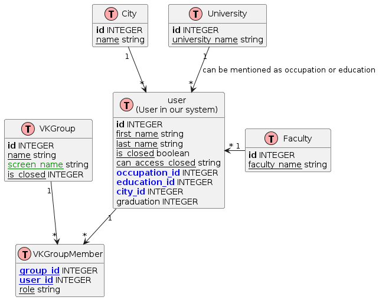

# VKgroup Analisys 2024</h1>
## INFO about project

### Group members and roles
1. **Bolotova Ekaterina** is responsible for data analysis
2. **Illarionov Alexey** is responsible for documentation and data collection

### Key Idea of the project
Analysis of the user's city and university based on the VK groups to which the user is subscribed.

### Description  of the project
<details>
  <summary>The main idea of the current project is to calculate the city and university based on user groups. We have two ideas for calculating the data:</summary>
    <ol>
      <li>
Set the central groups manually and go from them. That is, we identify those groups that, with a relatively high probability, may indicate that the user belongs to a particular city/university. Next, we collect user groups and find intersections, thereby defining a set of groups, participation in which increases the likelihood that the user belongs to a particular city/university.
      </li>
      <li>
Find the group data automatically by determining the concentration of users with a particular profile characteristic in the group. And then, after determining the main groups, go further along the first step.
Next, it is planned to compare the results obtained. We can also compare it with real user data (despite the fact that this information is not recorded at all, we can find out from a sufficient number of users) In fact, this approach is just an example that can be reused for other tasks, for example, to determine which political force the current user belongs to or which genre of music he prefers, and so on.
      </li>
    </ol>
</details>

## INFO about datasets

### ER diagram



<details>
<summary>plantUML</summary>
  
```plantUML
@startuml

!define Table(name,desc) class name as "desc" << (T,#FFAAAA) >>
!define primary_key(x) <b>x</b>
!define foreign_key(x) <color:blue><b>x</b></color>
!define unique(x) <color:green>x</color>
!define not_null(x) <u>x</u>
hide methods
hide stereotypes


Table(user, "user\n(User in our system)") {
  primary_key(id) INTEGER
  not_null(first_name) string
  not_null(last_name) string
  not_null(is_closed) boolean
  not_null(can_access_closed) string
  foreign_key(occupation_id) INTEGER
  foreign_key(education_id) INTEGER
  foreign_key(city_id) INTEGER
  graduation INTEGER
}

Table(VKGroup, "VKGroup") {
  primary_key(id) INTEGER
  not_null(name) string
  not_null(unique(screen_name)) string
  not_null(is_closed) INTEGER
}

Table(VKGroupMember, "VKGroupMember") {
  not_null(foreign_key(group_id)) INTEGER
  not_null(foreign_key(user_id)) INTEGER
  not_null(role) string
}

Table(City, "City") {
  primary_key(id) INTEGER
  not_null(name) string
}

Table(University, "University") {
  primary_key(id) INTEGER
  not_null(university_name) string
}

Table(Faculty , "Faculty") {
  primary_key(id) INTEGER
  not_null(faculty_name) string
}


user "1" --> "*" VKGroupMember
VKGroup "1" --> "*" VKGroupMember
City "1" --> "*" user
University "1" --> "*" user : "can be mentioned as occupation or education"
Faculty "1" -left-> "*" user

@enduml
```
</details>
